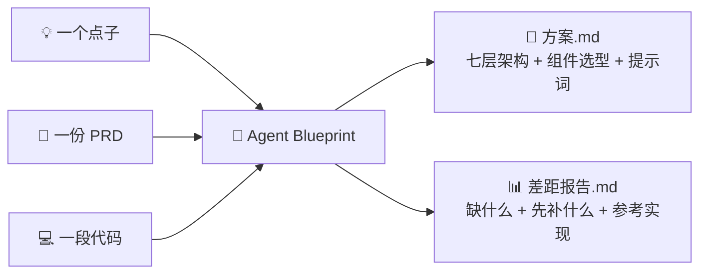

## 界面操作演示

<p align="center">
  <a href="assets/demo/startup.mp4"></a>
</p>

[观看 / 下载完整视频](assets/demo/startup.mp4) · [演示说明](assets/demo/startup.json)

实际操作 --offline 原型：上传合成插画 → 回答三个问题 → 查看报告 → 风格跟练。视觉输出为 mock，内容来自本地缓存，不是实际人脸识别或医疗判断。 画面按操作顺序录制，输入与阅读停留经过剪辑，不代表实际模型耗时。

<div align="center">

# 🧭 Agent Blueprint

**从「一个点子 · 一份 PRD · 一段代码」到「可落地的 Agent Harness 产品方案」**

[](https://github.com/hubooooooo/agent-blueprint/actions/workflows/test.yml)
[](LICENSE)
[](https://www.python.org/downloads/)

</div>

---

## 这是什么

一个**本地 Agent 需求引擎**：给 AI 一个模糊的想法，或一份写了一半的代码，它按内置规则推导出架构方案或差距报告，结果保存为文件。

**它解决两类问题：**

| 方向 | 你给 | 你得到 |
|---|---|---|
| 🔵 **正向** 点子 → 方案 | 一个想法 / 一份不完整 PRD | `方案.md`：需求拆解、组件选型、七层架构图、工具清单、系统提示词草案 |
| 🔴 **反向** 代码 → 差距 | 一段已经写了的项目代码 | `差距报告.md`：缺什么、先补什么、按什么标准补 ＋ `本该有的PRD.md` |



## 核心思路

> **模型是驾驶者，Harness 是载具。** 你构建的是载具，不是智能。

内置 **17 个生产级 Harness 组件**（`s01` Agent Loop ～ `s17` 目标闭环），覆盖行动、约束、认知、上下文、协作、编排六大域，每个都带「何时用 / 生产级要点 / 可运行的参考实现」。选型原则：**只选需要的，不为完整而选。**

---

## 快速开始

### 🍎 方式一：Mac 双击版（纯小白，零命令行）

双击 **`启动引擎.command`**，弹出终端窗口，一问一答带你走完全程：

1. 选模型服务商（推荐 **DeepSeek**，便宜）→ 粘贴 API Key → 自动测试连接；
2. 选「生成方案」或「检查差距」→ 粘贴想法或项目路径；
3. 自动推导，结果存进 `out/` 并提示打开。

首次双击会自动检测 Python，没装会帮你下载安装。想先看结果长什么样？看 [输出示例](docs/examples/README.md)。

### 🤖 方式二：交给能读文件的 AI（零安装）

把下面这段话交给 **Claude Desktop / Cursor 等能读本地文件的 AI**，替换路径和任务：

```text
引擎目录：/你的路径/agent-blueprint
先读这里的《使用引导.md》。
我的点子是：……（或：请检查这个项目：/你的路径/目标项目）
请生成方案（或：生成差距报告），告诉我结果存在哪里。
```

> 普通网页聊天窗口读不了本地文件，仅给路径是不够的。

### 💻 方式三：命令行（技术维护者）

要求 Python 3.10+，macOS / Linux：

```sh
bash setup.sh

# 正向：PRD / 一句话点子 → 方案
.venv/bin/python -m blueprint plan docs/prd-toy-theater.md -o out/my-plan

# 反向：已有项目 → 差距报告（可带 --prd 对照需求）
.venv/bin/python -m blueprint audit /目标项目路径 -o out/my-audit

# 中断后原目录续跑
.venv/bin/python -m blueprint plan docs/prd-toy-theater.md -o out/my-plan --resume
```

真实推导需要在 `.env` 配置 `ANTHROPIC_API_KEY`、`MODEL_ID`（支持 Anthropic 及 DeepSeek / 智谱 / Kimi / MiniMax 等兼容网关）。

---

## 项目结构

| 目录 / 文件 | 用途 |
|---|---|
| [使用引导.md](使用引导.md) | 给用户的任务模板与执行步骤（入口） |
| [BLUEPRINT.md](BLUEPRINT.md) | 五步推导、五要素、七层架构与组件选型表 |
| [blueprint/](blueprint/) | 正反向引擎：规则、扫描、审稿、断点续跑 |
| [s01–s17](BLUEPRINT.md) | 17 个组件的说明、参考实现与图示 |
| [scaffold/](scaffold/) | 后续开发的项目模板 |
| [skills/](skills/) | 构建 Agent、代码检查等技能示例 |
| [docs/](docs/) | 入门指南、输出示例、维护手册 |
| [evals/](evals/) · [tests/](tests/) | 规则题库与组件回归 |

## 验证与分发

```sh
.venv/bin/python -m pytest -q          # 全部测试
.venv/bin/python -m blueprint eval      # 离线题库回归

python3 tools/package_student.py        # 生成学生压缩包
```

把 `dist/agent-blueprint-student.zip` 发给学生即可：保留引擎、手册、全部组件参考与测试，排除本机密钥、虚拟环境、Git 历史与缓存。

---

## 文档导航

| 我想… | 看这里 |
|---|---|
| 第一次用 | [使用引导.md](使用引导.md) → [输出示例](docs/examples/README.md) |
| 只有一个模糊想法 | [小白入门指南](docs/beginner-guide.md) |
| 看一份完整方案长什么样 | [玩具剧场方案](docs/prd-toy-theater.md) |
| 改规则 / 换模型 / 分发 | [维护手册](docs/维护手册.md) |

---

<div align="center">

作者：**Hubo** · [MIT 许可证](LICENSE) · [教程视频](https://www.bilibili.com/video/BV17RtD61ETm/)

</div>
